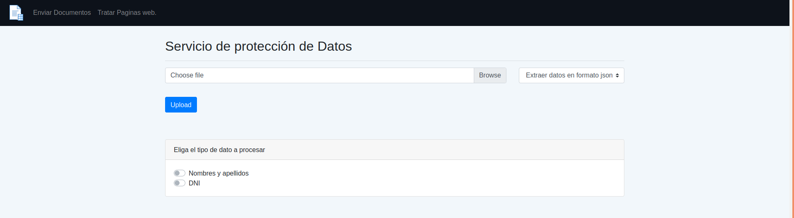
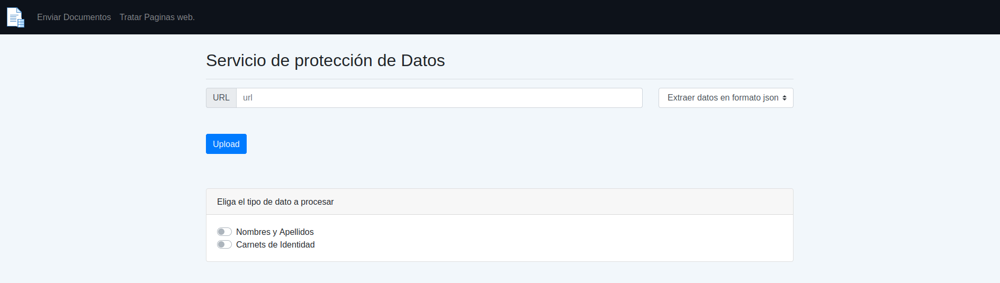
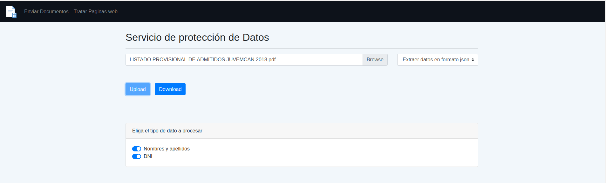
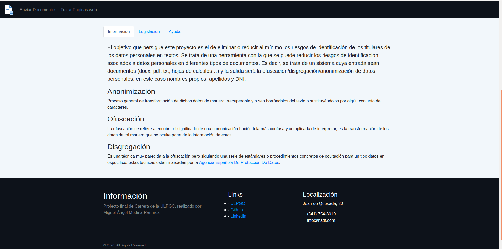
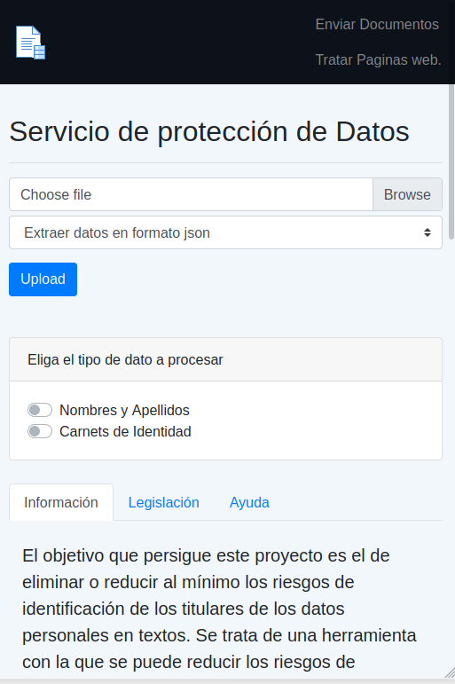

## Author 
Miguel Ángel Medina Ramírez <br>

# Personal data Protection Service
It is a web service dedicated to the extraction and modification of personal data. After the organic data protection law of 2018, data that compromises the identity of natural persons in texts may violate their right to privacy and intimacy, therefore a series of processes is necessary to treat the data without putting their users at risk. Headlines. These anonymization / obfuscation / disintegration processes are transformations that are carried out to the data that consist in the total or partial modification of the same, in such a way that no one can recognize them or that only the owner of the data can recognize them. This service implements a series of operations to process web documents, spreadsheets, pdf, word and plain text in order to locate, extract and operate with this data. We focus only on names, surnames and identity cards because they are the most immediately compromised personal data, however the techniques used can be extrapolated to any other type of data. 

## API REST
- **/search/version:** Returns by GET the current version of the software.

- **/search/file/encode:** It is responsible for collecting files via POST and returning
another version of them with anonymized personal data. You receive through the query string the type of data that you have to locate in the document.

- **/search/file/disintegration:** It is responsible for collecting files through POST and
return another version of them with the personal data transformed through a
disaggregation process. It receives through the query string the type of data that it has to locate in the document.

- **/search/file/obfuscation:** It is responsible for collecting files via POST and returning another version of them with the personal data transformed by means of a
obfuscation process. It receives through the query string the type of data that it has to locate in the document.

- **/search/file/extract-data/json-file:** It is responsible for collecting files through POST and
to return a json file with the personal data found. It receives through the query string the type of data that it has to locate in the document.

- **/search/file/extract-data/json:** It is responsible for collecting files through POST and
return a json object with the personal data found. It receives through the query string the type of data that it has to locate in the document.

- **/search/file/extract-data/csv:** It is responsible for collecting files via POST and
return a csv file with the personal data. It receives through the query string the type of data that it has to locate in the document.

- **/search/file/operation-web:** It is in charge of collecting a URL and a
type of data transformation or extraction operation, and of returning a file
json or csv with the data or the html file with the transformed entities. It receives through the query string the type of data that it has to locate in the document.

- **/search/file/tagger-html:** The last endpoint is responsible for collecting html files
via POST and returning them, but marked with the tagged data. It receives through the query string the type of data that it has to locate in the document. This resource is to have a visual representation of the goodness of the system in locating the data. 

## Frontend

A frontend proposal is also proposed for the user to interact with the API through a web interface. 

<p align="center">
  
</p>
<p align="center">
  Figure 1: Upload documents. 
</p>

<p align="center">
  
<p align="center">
  Figure 2: Submit a URL to the service. 
</p>

<p align="center">
  
</p>
<p align="center">
  Figure 3: Perform some operation. 
</p>

<p align="center">
  
</p>
<p align="center">
  Figure 4: Information, Legislation and user help.
</p>

<p align="center">
  
</p>
<p align="center">
  Figure 5: Frontend on a mobile. 
</p>

## Execution

To run the project you need to have Python3.6 installed, because some dependencies do not go well with the recent Python updates at least at the time of development of this software.

### Install Dependencies

Whether in a virtual environment or not, the first thing to do is install the dependencies of the * requirements.txt * file. It can be done with pip or any other package manager. 

```bash
  git clone https://github.com/miguel-kjh/NameSearcher-WebService
  cd NameSearcher-WebService/backend/
  pip install -r requirements.txt
```

This project uses artificial intelligence models and algorithms applied to natural language processing, therefore they must be downloaded from the SpaCy and NLTK dependencies.

```bash
  python -m spacy download es_core_news_md
  python -m nltk.downloader punkt
```


### Run the service for Windows, Mac or Linux

By default it opens on port 5000. 

```bash
  python backend/manage.py run  # Ejecuta el servicio
  python backend/manage.py test # Ejecuta las pruebas
  python backend/cleanDB.py     # Limpia la BD
```

### Migrate the database 

```bash
  python backend/manage.py db migrate --message 'new schema'
  python backend/manage.py db upgrade
```

### Run the frontend for Windows, Mac or Linux

By default it opens on port 5001. 

```bash
  python frontend/run.py  # Ejecuta el frontend
```

## Use gunicorn to open the service in production
The previous commands are used to execute and deploy both the backend and the frontend from the server that ** Flask ** offers us, however this server is not optimized for a production environment. By cons it is recommended to use **Gunicorn**.
**Gunicorn** is a tool that offers us a production environment for web servers in python, in addition to the fact that it already comes with the project dependencies.

```bash
  gunicorn --bind ip_de_la_máquina:5000 manage:app --timeout 300 &  # Abre la API a internet
  gunicorn --bind ip_de_la_máquina:5001 run:app & # Abre el frontend a internet
```

Finally, you have to change a global variable in the file [script.js](./frontend/static/js/script.js), the **server** variable marks the address where the API is implemented, you just have to replace it with the corresponding address. 

## Demo
A demo of a possible service application has been designed, you can try it from the following [link](http://185.47.13.9:5001/).

## License
Licensed under the Apache License, Version 2.0. Copyright 2019 Miguel Ángel Medina Ramírez.
