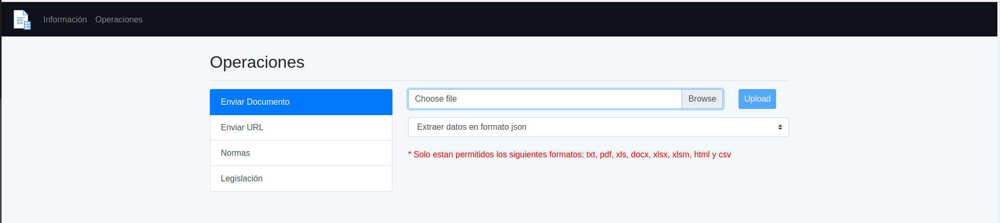
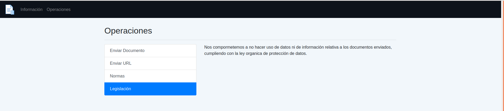
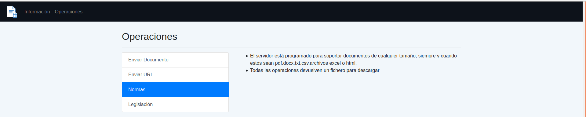
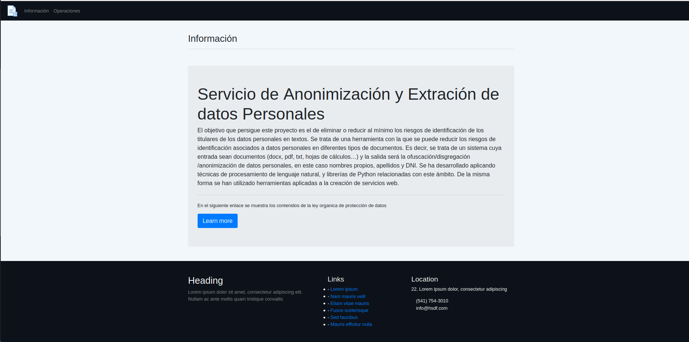

## Autor
Miguel Ángel Medina Ramírez <br>
Correo: miguel.medina108@alu.ulpgc.es

# NameSearcher-WebService
Se trata de un servicio web dedicado a la extracción y la modificación de datos personales. Tras la ley de orgánica de protección de datos de 2018, los datos que comprometan la identidad de personas físicas en textos pueden vulnerar su derecho de privacidad e intimidad, por ello es necesario una serie de procesos para tratar los datos sin poner en riesgo a sus titulares. Estos procesos de anonimización/ofuscación/disgregación son transformaciones que se realizan a los datos que consisten en la modificación total o parcial de los mismos,de tal forma que nadie los pueda reconocer o que únicamente el poseedor de los datos pueda reconocerlos. Este servicio implementa una serie de operaciones para tratar documentos web, hojas de cálculo, pdf, word y texto plano con el objetivo de localizar,extraer y operar con estos datos. Nos centramos únicamente en nombres, apellidos y carnés de identidad debido a que son los datos personales más comprometidos de forma inmediata, sin embargo las técnicas utilizadas son extrapolables a cualquier otro tipo de dato.

## API REST
- **/search/version:** Devuelve mediante GET la version actual del software.
- **/search/file/encode:** Se encarga de recoger ficheros mediante POST y de devolver
otra versión de ellos con los datos personales anonimizados.
- **/search/file/disintegration:** Se encarga de recoger ficheros mediante POST y de
devolver otra versión de ellos con los datos personales transformados mediante un
proceso de disgregación.
- **/search/file/obfuscation:** Se encarga de recoger ficheros mediante POST y de devolver otra versión de ellos con los datos personales transformados mediante un
proceso de ofuscación.
- **/search/file/extract-data/json-file:** Se encarga de recoger ficheros mediante POST y
de devolver un fichero json con los datos personales encontrados.
- **/search/file/extract-data/json:** Se encarga de recoger ficheros mediante POST y de
devolver un objeto json con los datos personales encontrados.
- **/search/file/extract-data/csv:** Se encarga de recoger ficheros mediante POST y de
devolver un fichero csv con los datos personales.
- **/search/file/operation-web:** Se encarga mediante GET de recoger una URL y un
tipo de operación de transformación o extracción de datos, y de devolver un archivo
json o csv con los datos o el archivo html con las entidades transformadas.
- **/search/file/tagger-html:** El último endpoint se encarga de recoger ficheros html
mediante POST y de devolverlos, pero marcados con los datos etiquetados. Este
recurso está para tener una representación visual de la bondad del sistema en la
localización de los datos.

## Frontend

Tambien se propone una propuesta de frontend para que el usuario interactue con la API mediante una interfaz web.


<p align="center">
  
</p>
<p align="center">
  Figura 1: Subir documentos al servicio
</p>

<p align="center">
  
</p>
<p align="center">
  Figura 2: Legislación
</p>

<p align="center">
  
</p>
<p align="center">
  Figura 3: Subir una URL al servicio
</p>

<p align="center">
  
</p>
<p align="center">
  Figura 4: Reglas del servicio
</p>

<p align="center">
  
</p>
<p align="center">
  Figura 5: Descripción del servicio
</p>

## Ejecución

Para ejecutar el proyecto se necesita tener instalado Python3.6, debido a que algunas dependencias no van bien con las recientes actualizaciones de Python al menos en el momento del desarrollo de este software.

### Instalar Dependencias

Ya sea en un entorno virtual o no, lo primero que se tiene que hacer es instalar las dependencias del archivo *requirements.txt*. Se puede hacer con pip o cualquier otro gestor de paquetes.

```bash
  git clone https://github.com/miguel-kjh/NameSearcher-WebService
  cd NameSearcher-WebService/backend/
  pip install -r requirements.txt
```

### Ejecutar el servicio para Windows, Mac o Linux

Por defecto se abre en el puerto 5000.

```bash
  python backend/manage.py run  # Ejecuta el servicio
  python backend/manage.py test # Ejecuta las pruebas
  python backend/cleanDB.py     # Limpia la BD
```

### Migrar la base de datos

```bash
  python backend/manage.py db migrate --message 'new schema'
  python backend/manage.py db upgrade
```

### Ejecutar el frontend para Windows, Mac o Linux

Por defecto se abre en el puerto 5001.

```bash
  python frontend/run.py  # Ejecuta el frontend
```

### Usar ngrok para abrir el servicio
El servicio se puede desplegar o poner en producción de muchas formas, pero
ngrok nos ofrece un despliegue rápido y sencillo, tanto para http como para https.
```bash
  ngrok http 5000 # Abre la API a internet
  ngrok http 5001 # Abre el frontend a internet
```

## License
Licensed under the Apache License, Version 2.0. Copyright 2019 Miguel Ángel Medina Ramírez.
